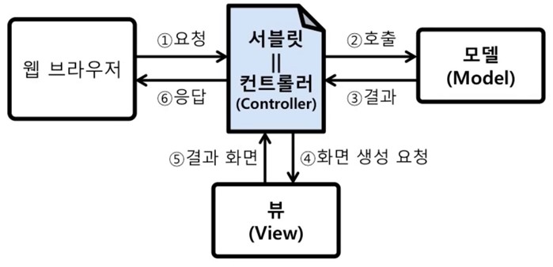
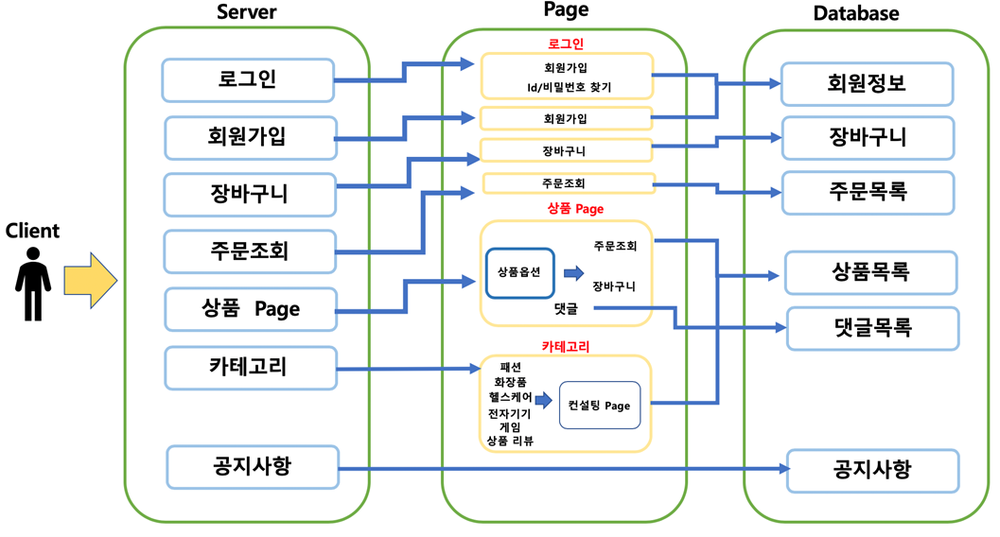
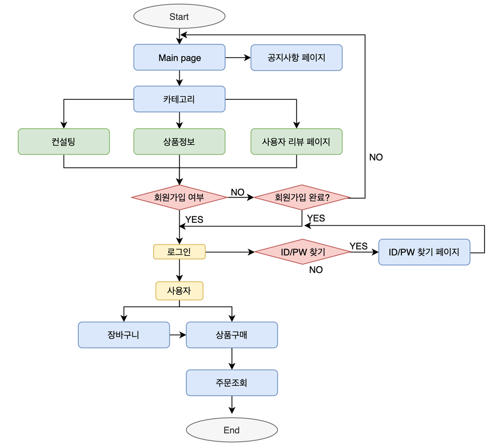

# Manvengers: Comprehensive men's site using database (Manvengers)

> - *데이터베이스를 사용한 남성 종합 사이트 (맨벤져스)*

관련 보고서는 [여기서](./report.pdf) 확인할 수 있고 실행과정은 [영상](https://drive.google.com/file/d/1BXW2nbk9H1XQGLq5pmPWM_NvHIF-z1Dh/view?usp=share_link )으로 확인할 수 있습니다.

## 요약
‘그루밍 족’은 패션과 미용에 아낌없이 투자하는 남성들을 의미하는 신조어이다. 현재 이와같은 ‘그루밍 족’들이 점점 늘어나고 있지만 자기관리 방법을 모르는 남성들도 대부분이다. 그러나 지금 있는 사이트들은 통합되여 있지 않는 문제점이 있을 뿐만 아니라 남성 전용 사이트도 존재하지 않는다. 따라서 본 프로젝트는 아래와 같은 남성 종합사이트를 만들고자 합니다.
1. 탐색의 불편함을 최소화 하기 위해 남성이 관심 있는 각종 분야들 (패션, 화장품, 헬스케어, 게임, 전자기기 들)을 통합 
2. 분야 별로 정보 또는 관리 방법들을 알려줌
3. 자기에 어울리는 코디, 피부에 맞는 화장품과 체형에 맞는 운동방법 및 식단법을 알려 줌
4. 여러 사람들이 자신이 사용한 상품에 대한 리뷰를 공유
   
## MCV 모델
### MCV 구성도

- 컨트롤러: 요청 처리 및 흐름 제어 담당하는 부분이다.
- 모델: 비즈니스 로직 및 데이터 처리를 담당하는 부분이다.
- 뷰: 모델이 처리한 결과 데이터를 가지고 화면 생성해 준는 부분이다.

 

<table>
  <tr>
    <th align="center">MCV 요소</th>
    <th align="center">구현 프로그램</th>
    <th align="center">역할</th>
  </tr>

  <tr>
    <td align="center" rowspan="6">Model</td>
    <td align="center">Cart.java, Fashion.java, Point.java, Notice.java, Comment.java</td>
    <td align="left">getter, setter method</td>
  </tr>
  <tr>
    <td align="center">CartDatabase.java</td>
    <td align="left">장바구니(cart database), 주문 목록(OrderTable database) 을 조회하거나 삽입한다.</td>
  </tr>
  <tr>
    <td align="center">FashionDatabase.java</td>
    <td align="left">상품의 모든 정보를 읽어 오거나 조건에 맞는 상품정보를 데이터베이스에서 읽어 온다.</td>
  </tr>
  <tr>
    <td align="center">loginDatabase.java</td>
    <td align="left">로그인을 관련 정보를 데이터 베이스에서 불러온다. 아이디 찾기,로그인을 담당한다.</td>
  </tr>
  <tr>
    <td align="center">MemberDatabase.java</td>
    <td align="left">회원가입정보를 저장하거나 불러온다.</td>
  </tr>
  <tr>
    <td align="center">NoticeDatabase.java</td>
    <td align="left">공지사항을 조회한다.</td>
  </tr>

  <tr>
    <td align="center" rowspan="12">View</td>
    <td align="center">ProductList.jsp</td>
    <td align="left">카테고리별 페이지이다. main.jsp에서 받아온 table이름과 id를 받아서 각 카테고리(패션, 화장품, 헬스케어, 전자기기,
                        게임, 리뷰상품)의 상품 또는 게임설명을 보여주고 상품을 클릭시 받은 값을 Board.jsp로 전달 해 주는 페이지 </td>
  </tr>
  <tr>
    <td align="center">Board.jsp</td>
    <td align="left">상품(패션, 화장품, 헬스음식, 전자기기) 판매 페이지므로 해당 상품의 가격, 수량, 컬러, 사이즈 등 정보들을 전달해준다. 
                        구매버튼을 클릭시 cartorder.jsp로 전달, 장바구니버튼 클릭시 cart.jsp로 전달.</td>
  </tr>
  <tr>
    <td align="center">exfashion.jsp</td>
    <td align="left">채형별로 어울리는 옷을 설명 해 주는 페이지</td>
  </tr>
  <tr>
    <td align="center">exlep.jsp</td>
    <td align="left">채형별로 맞는 운동법과 식단법을 알려 주는 페이지</td>
  </tr>
  <tr>
    <td align="center">exskin.jsp</td>
    <td align="left">피부의 타입별로 맞는 화장품 종류를 알려 주는 페이지</td>
  </tr>
  <tr>
    <td align="center">review.jsp</td>
    <td align="left">사용자가 자기가 사용하는 상품을 동영상 또는 리뷰글의 형식으로 보여주는 페이지</td>
  </tr>
  <tr>
    <td align="center">login.jsp</td>
    <td align="left">로그인 결과에 따라 성공하면 메시지를 출력하고, 실패하면 다시 로그인 화면을 출력</td>
  </tr>
  <tr>
    <td align="center">join.jsp</td>
    <td align="left">회원가입 페이지이다. 입력한 정보를 joinDatabase.jsp로 전달.</td>
  </tr>
  <tr>
    <td align="center">find.jsp</td>
    <td align="left">아이디, 비밀번호 찾기. findMemberDatabase에서 이름, 이메일을 받아서 찾아주는 페이지.</td>
  </tr>
  <tr>
    <td align="center">cart.jsp</td>
    <td align="left">CartDatabase.java에서 받은 장바구니 상품을 보여주는 페이지</td>
  </tr>
  <tr>
    <td align="center">ouder.jsp</td>
    <td align="left">CartDatabase.java에서 받은 주문 상품을 보여주는 페이지</td>
  </tr>
  <tr>
    <td align="center">notice.jsp</td>
    <td align="left">데이터베이스에서 받은 공지사항을 보여주는 페이지</td>
  </tr>

  <tr>
    <td align="center" rowspan="6">Controller</td>
    <td align="center">cartorder.jsp</td>
    <td align="left">cart.jsp(장바구니) 에서 체크되어 있는 값을 가져와 orderTable(주문목록 데이터 베이스)에 추가하고 order.jsp로 연결한다.</td>
  </tr>
  <tr>
    <td align="center">FindMemberdatabase.jsp</td>
    <td align="left">비밀번호를 찾아주는 Controller 이다. find.jsp에서 입력받은 아이디와 이메일을 가져와 일치하는 회원이 있는지 검색한다. 작업이 끝나면 로그인 페이지로 이동한다. </td>
  </tr>
  <tr>
    <td align="center">joinDatabase.jsp</td>
    <td align="left">회원가입을 해주는 Controller 이다. join.jsp의 입력값을 받은후 회원 데이터베이스(Member)에 저장한다 실패시 로그인 페이지로 이동하고 성공시 main.jsp로 이동한다.</td>
  </tr>
  <tr>
    <td align="center">loginDatabase.jsp</td>
    <td align="left">로그인을 담당해주는 Controller 이다. 로그인에 성공하면 main.jsp	로 이동하며 실패시 로그인 페이지로 돌아간다. </td>
  </tr>
  <tr>
    <td align="center">logout.jsp</td>
    <td align="left">로그아웃을 해주는 Controller 이다. session을 삭제한뒤 main.jsp로 이동한다.</td>
  </tr>
  <tr>
    <td align="center">registerComment</td>
    <td align="left">Board.jsp에서 입력받은 댓글을 등록해 주는 Controller 이다.만약 세션에 저장된 아이디나 비밀번호가 없다면 뒤로가기를 하고 있으면 댓글을 등록한다.</td>
  </tr>
</table>

## System Diagram
 

## Flow Chart
 

## Contact
Should you have any question, please contact gooni0906@gmail.com.
